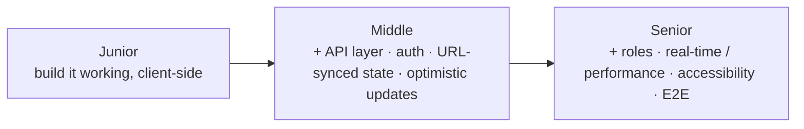
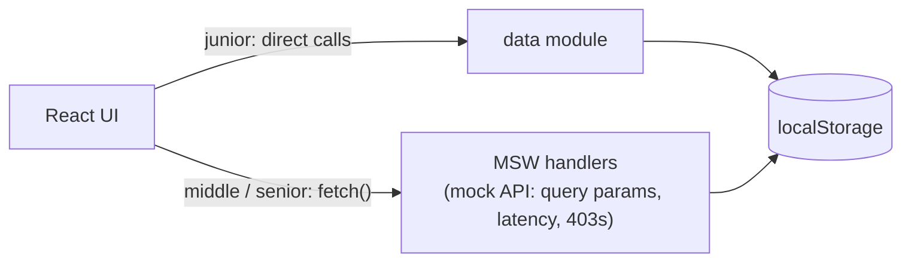
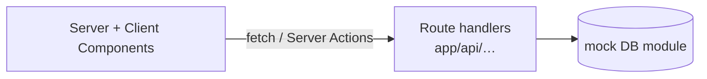

# Front-End Training Program

A month-long, build-to-spec program for new recruits. You pick one **project**, build it at your
**level**, and ship a pull request every week. Everything runs on mock data — **no real backend**.

---

## How it works

- **One project per month.** Choose a project below and the level that fits you.
- **Same screens at every level — the depth is what changes.** A junior builds the whole app working
  client-side; middle and senior layer on a real API boundary, auth, performance, and tests. (See the
  [level ladder](#the-level-ladder).)
- **Weekly loop.** Each week ends with a **pull request**; address the review feedback before moving on.
- **AI is allowed**, but you must understand and be able to **defend every line**.

---

## Projects

| Project                   | What you build                                      | Stack                       | Levels                                                                                                                   |
| ------------------------- | --------------------------------------------------- | --------------------------- | ------------------------------------------------------------------------------------------------------------------------ |
| **Admin Dashboard**       | A shop back-office: products, orders, customers     | React + Vite + React Router | [Junior](projects/admin/junior/) · [Middle](projects/admin/middle/) · [Senior](projects/admin/senior/)             |
| **Kanban Board**          | A Trello-style board with drag-and-drop             | React + Vite + React Router | [Junior](projects/kanban/junior.md) · [Middle](projects/kanban/middle.md) · [Senior](projects/kanban/senior.md)          |
| **E-commerce Storefront** | Catalog → cart → checkout, plus a small admin       | Next.js (App Router)        | [Junior](projects/ecommerce/junior.md) · [Middle](projects/ecommerce/middle.md) · [Senior](projects/ecommerce/senior.md) |
| **Blog**                  | Public site + author dashboard + editorial workflow | Next.js (App Router)        | [Junior](projects/blog/junior.md) · [Middle](projects/blog/middle.md) · [Senior](projects/blog/senior.md)                |

Each level is a folder with **`README.md`** (the spec the trainee builds), **`evaluation.md`** (a placement
rubric, for leaders), and **`flow.md`** (a Mermaid screen-flow diagram).

---

## The level ladder

The screen set is identical across a project's three levels. What ramps is _how deep you build it_.



---

## Architecture — where the data lives

Mock data, seeded with [`@faker-js/faker`](https://www.npmjs.com/package/@faker-js/faker), persisted to
**localStorage** so edits survive a reload. The difference between levels is the **boundary** in front of
that data.

**SPA projects (Admin, Kanban):**



- **Junior** talks to the data module directly — no server concept.
- **Middle / senior** put a **mock API layer in front** (MSW recommended) so the UI speaks HTTP. The store
  is the same localStorage; what's new is the client/server boundary. See **[msw-setup.md](msw-setup.md)**.

**Next.js projects (E-commerce, Blog):**



---

## Shared conventions

- **Stack** — SPA projects: React + Vite + **TypeScript** + React Router. Next.js projects: **App Router**,
  server-first. **Avoid `any`.**
- **Data** — mock, no real backend; seed with **faker**. Admin/Kanban persist to localStorage (junior reads
  the module directly; middle/senior go through a mock API layer, **MSW** recommended). Ecommerce/Blog use
  **Next.js route handlers**.
- **Responsive** — every screen works from mobile to desktop.
- **Testing** — middle: **Vitest + React Testing Library**; senior adds **Playwright** (E2E).
- **UI library is your choice** — shadcn/ui, Ant Design, MUI, or hand-rolled. Any library named in a spec is
  a _suggestion_, not a requirement.

---

## Getting started

1. Pick a **project** and your **level**, and open `projects/<project>/<level>.md`.
2. Scaffold the app for that stack.
3. For Admin/Kanban **middle & senior**, set up the mock API layer — follow **[msw-setup.md](msw-setup.md)**.
4. Build to the spec, commit in small steps, and open a **pull request at the end of each week**.

---

## Repo layout

```
projects/<project>/<level>/
    README.md          the spec (what the trainee builds)
    evaluation.md      placement rubric (for leaders)
    flow.md            screen-flow diagram (Mermaid)
msw-setup.md         how to wire up MSW as the mock API layer (Vite projects)
README.md            you are here
```
