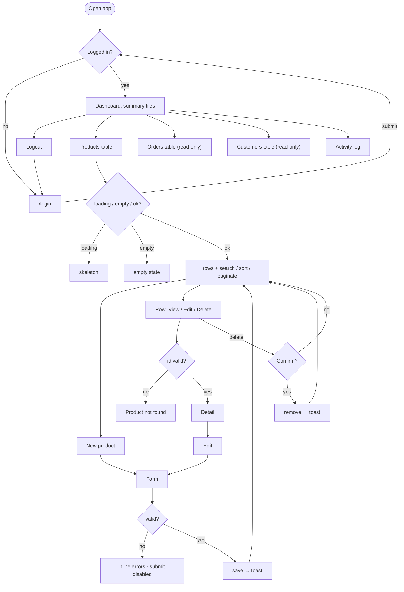

# Flow — Admin Dashboard · Junior

Screen / user flow for the build.

```mermaid
flowchart TD
  Start(["Open app"]) --> G{"Logged in?"}
  G -- no --> Login["/login"]
  Login -- submit --> G
  G -- yes --> Dash["Dashboard: summary tiles"]
  Dash --> Out["Logout"] --> Login
  Dash --> P["Products table"]
  Dash --> O["Orders table (read-only)"]
  Dash --> C["Customers table (read-only)"]
  Dash --> A["Activity log"]
  P --> S{"loading / empty / ok?"}
  S -- loading --> Sk["skeleton"]
  S -- empty --> Em["empty state"]
  S -- ok --> L["rows + search / sort / paginate"]
  L --> New["New product"] --> F["Form"]
  L --> Row["Row: View / Edit / Delete"]
  Row --> D{"id valid?"}
  D -- no --> NF["Product not found"]
  D -- yes --> Det["Detail"] --> Edit["Edit"] --> F
  F --> V{"valid?"}
  V -- no --> Er["inline errors · submit disabled"]
  V -- yes --> Sv["save → toast"] --> L
  Row -- delete --> Cf{"Confirm?"}
  Cf -- yes --> Del["remove → toast"] --> L
  Cf -- no --> L
```
