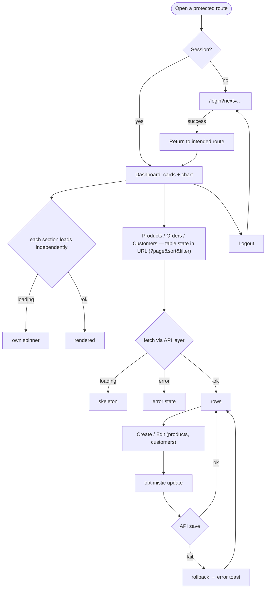

# Flow — Admin Dashboard · Middle

Screen / user flow for the build.

Table filter/sort/page live in the URL (shareable, refresh-safe, back button works). CRUD goes through the
API layer; updates apply optimistically and roll back on failure — triggerable via the failure-injection
toggle.
