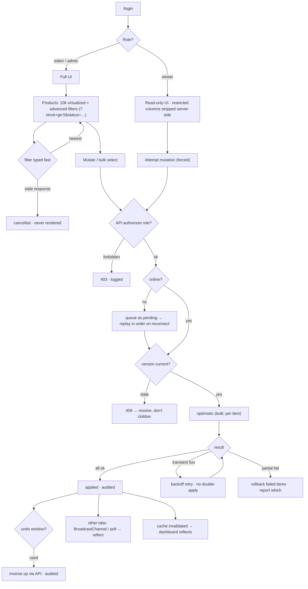

# Flow — Admin Dashboard · Senior

Screen / user flow for the build.

Authorization and auditing live in the API layer — a forced `viewer` request still gets a `403` and is
still logged, and a save against a stale version gets a `409`. Bulk actions apply optimistically and roll
back per-item on partial failure. Offline mutations queue and replay in order; every applied mutation
invalidates the cache so other views and tabs reflect it.
