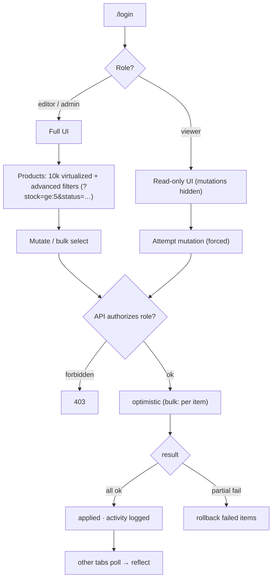

# Flow — Admin Dashboard · Senior

Screen / user flow for the build.

Authorization lives in the API layer — a forced `viewer` request still gets a `403`. Bulk actions apply
optimistically and roll back per-item on partial failure; other tabs pick up changes by polling.
