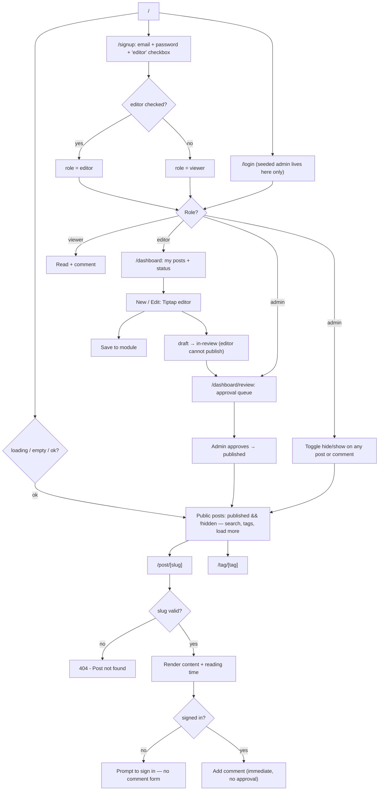

# Flow — Blog · Junior

Screen / user flow for the build.

Signup picks the role via a checkbox — editor or viewer; admins are seeded only. Commenting requires a
sign-in but no approval. Only an admin approves posts, and only an admin toggles hide/show, which is
independent of the draft → in-review → published status.
