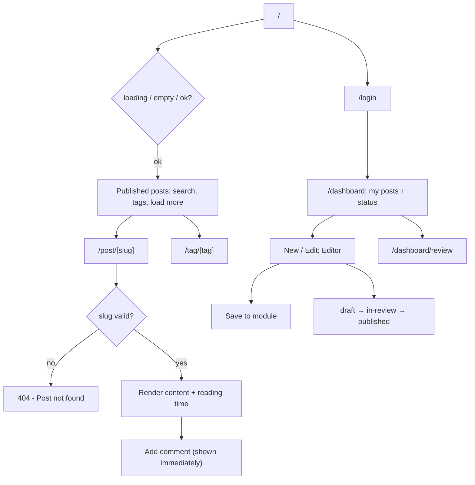

# Flow — Blog · Junior

Screen / user flow for the build.

```mermaid
flowchart TD
  Home["/"] --> S{"loading / empty / ok?"}
  S -- ok --> List["Published posts: search, tags, load more"]
  List --> Post["/post/[slug]"]
  Post --> V{"slug valid?"}
  V -- no --> NF["404 - Post not found"]
  V -- yes --> Render["Render content + reading time"]
  Render --> Cm["Add comment (shown immediately)"]
  List --> Tag["/tag/[tag]"]
  Home --> Login["/login"] --> Dash["/dashboard: my posts + status"]
  Dash --> Edit["New / Edit: Editor"] --> Save["Save to module"]
  Edit --> St["draft → in-review → published"]
  Dash --> Rev["/dashboard/review"]
```
