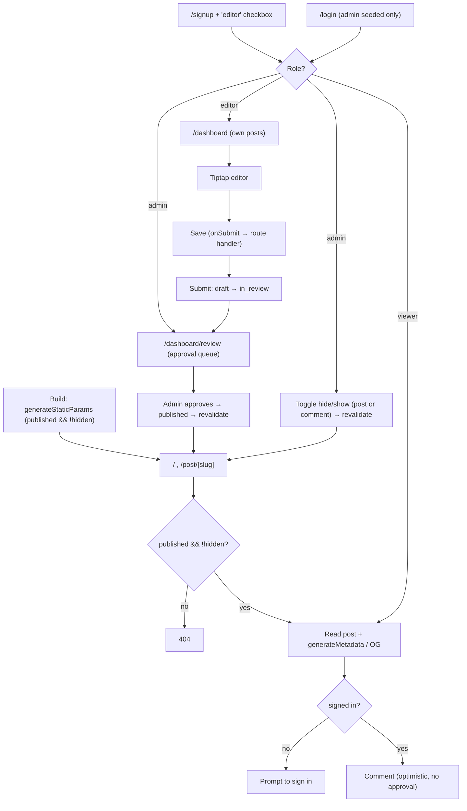

# Flow — Blog · Middle

Screen / user flow for the build.

Public pages are statically generated and revalidated (ISR); a post is public only when published and not
hidden. Signup picks viewer or editor by checkbox; admins are seeded. An editor submits for review but only
an admin approves, and only an admin toggles hide/show — both trigger revalidation so the public site
reflects the change without a rebuild.
