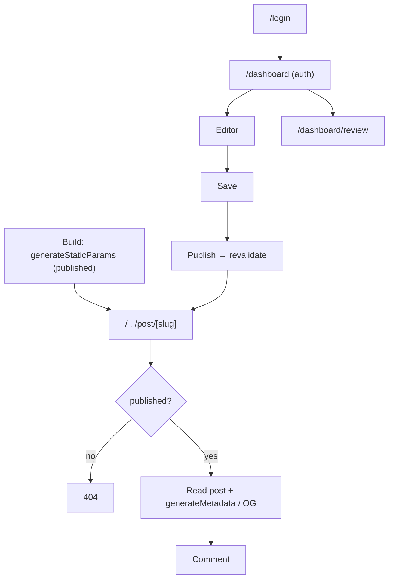

# Flow — Blog · Middle

Screen / user flow for the build.

Public pages are statically generated and revalidated (ISR). Publishing from the dashboard triggers
revalidation so the change shows up without a rebuild.
