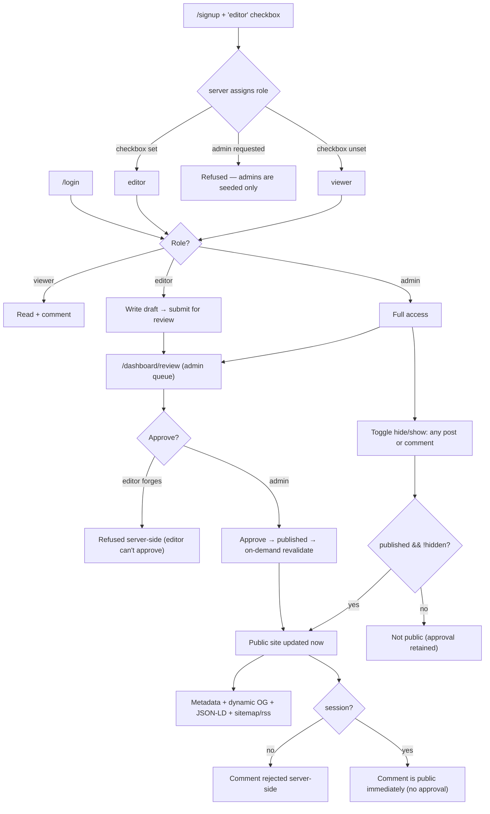

# Flow — Blog · Senior

Screen / user flow for the build.

Authorization is server-side throughout: the signup checkbox is a hint, not a trust boundary, and an admin
role can never be requested; an editor can submit but not approve, and a forged approve is refused; a
signed-out comment is rejected. Approving and hiding both use on-demand revalidation so the public site
updates immediately. Hide/show is orthogonal to status — hiding a published post keeps its approval.
