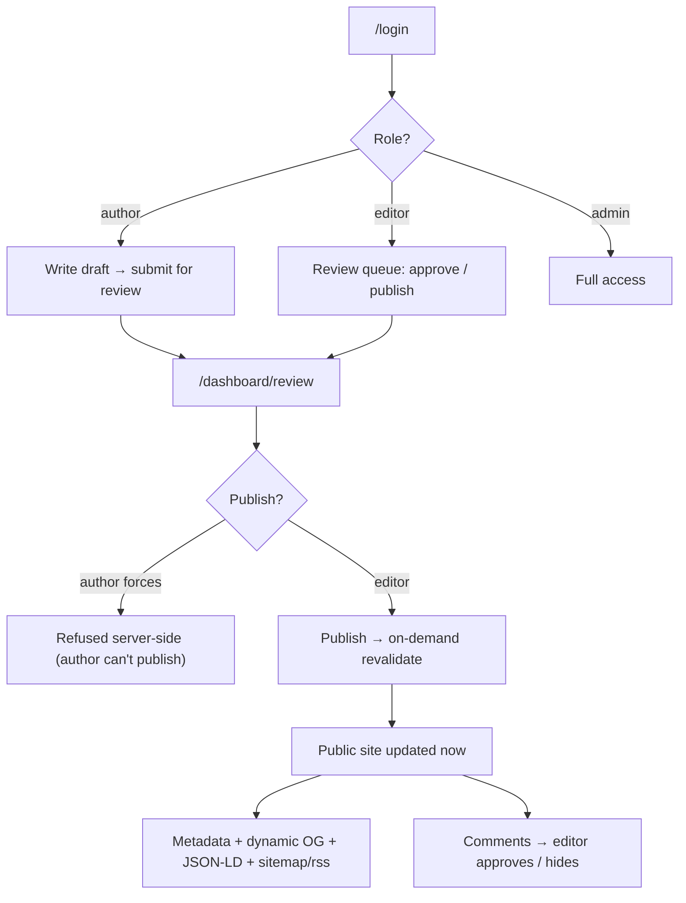

# Flow — Blog · Senior

Screen / user flow for the build.

Authorization is server-side: an author can submit but not publish; a forced publish is refused. Publishing
uses on-demand revalidation so the public site updates immediately.
