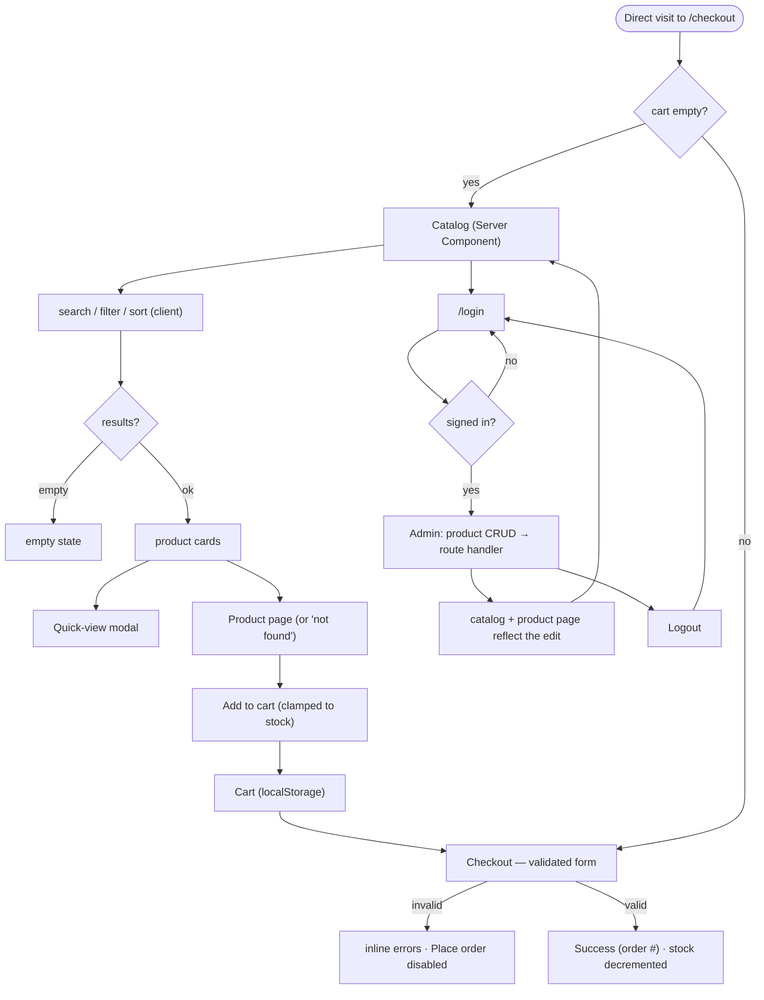

# Flow — E-commerce Storefront · Junior

Screen / user flow for the build.

```mermaid
flowchart TD
  Home["Catalog (Server Component)"] --> Q["search / filter / sort (client)"]
  Q --> Grid{"results?"}
  Grid -- empty --> Em["empty state"]
  Grid -- ok --> Cards["product cards"]
  Cards --> Quick["Quick-view modal"]
  Cards --> PP["Product page (or 'not found')"]
  PP --> Add["Add to cart (clamped to stock)"] --> Cart["Cart (localStorage)"]
  Cart --> Checkout["Checkout — validated form"]
  Checkout -- invalid --> Er["inline errors · Place order disabled"]
  Checkout -- valid --> Success["Success (order #) · stock decremented"]
  Direct(["Direct visit to /checkout"]) --> Empty{"cart empty?"}
  Empty -- yes --> Home
  Empty -- no --> Checkout
  Home --> Login["/login"] --> Gate{"signed in?"}
  Gate -- no --> Login
  Gate -- yes --> Admin["Admin: product CRUD → route handler"]
  Admin --> Rv["catalog + product page reflect the edit"] --> Home
  Admin --> Out["Logout"] --> Login
```
