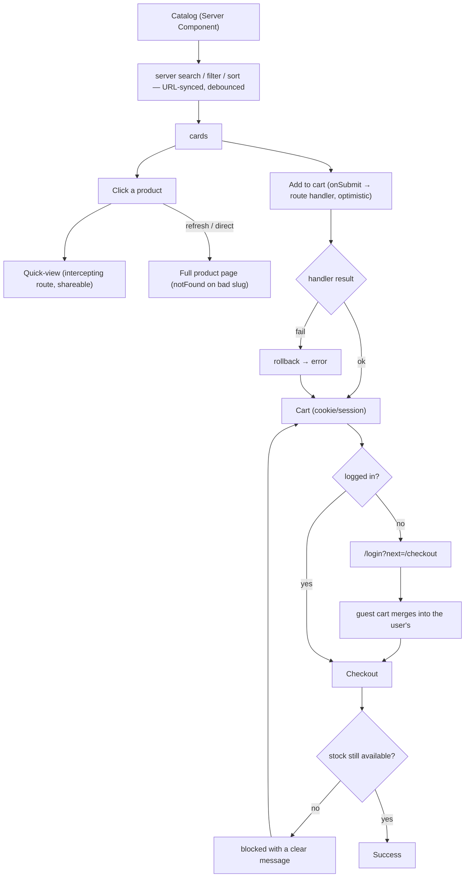

# Flow — E-commerce Storefront · Middle

Screen / user flow for the build.

Search is server-side and URL-synced; the quick-view is an intercepting route with a full-page fallback; the
cart posts to route handlers from `onSubmit`, applies optimistically with rollback on failure, and persists
in a cookie/session. Stock is re-checked server-side before the order confirms.
