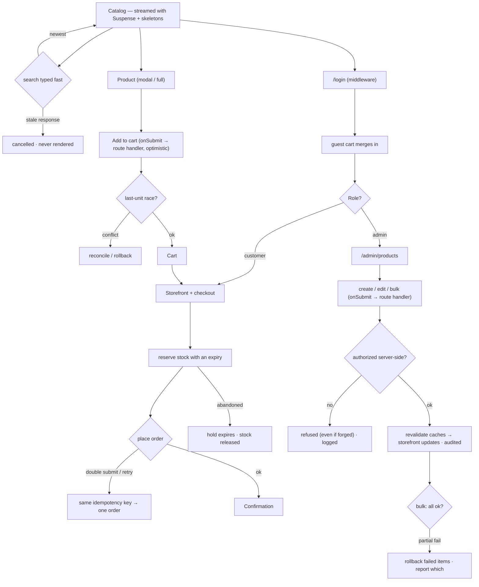

# Flow — E-commerce Storefront · Senior

Screen / user flow for the build.

Roles run through middleware and are authorized server-side, and admin changes are audited in the route
handler so a forged request is recorded too. The catalog streams; concurrent last-unit adds reconcile;
checkout holds stock with an expiry; order placement is idempotent under retry; the modal traps and
restores focus.
