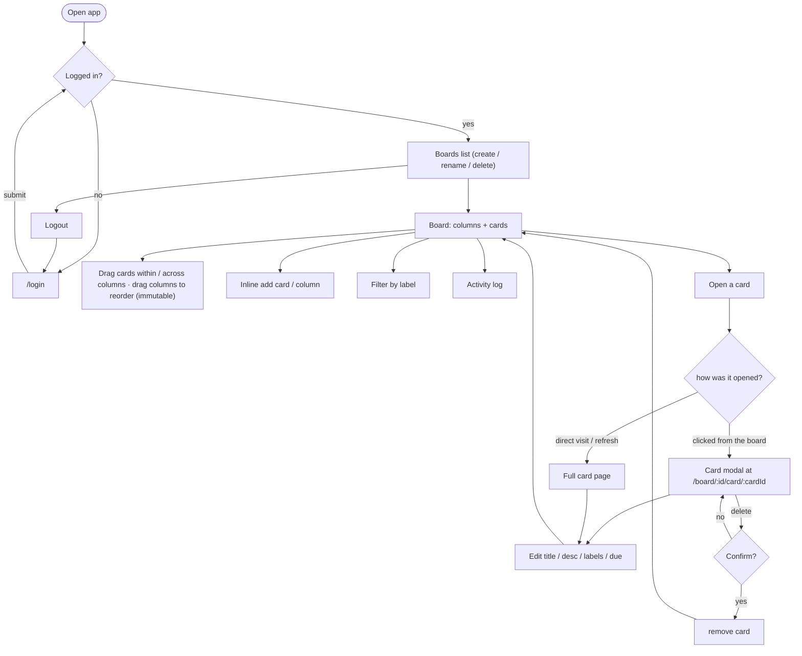

# Flow — Kanban Board · Junior

Screen / user flow for the build.

```mermaid
flowchart TD
  Start(["Open app"]) --> G{"Logged in?"}
  G -- no --> Login["/login"]
  Login -- submit --> G
  G -- yes --> Boards["Boards list (create / rename / delete)"]
  Boards --> Out["Logout"] --> Login
  Boards --> Board["Board: columns + cards"]
  Board --> DnD["Drag cards within / across columns · drag columns to reorder (immutable)"]
  Board --> Add["Inline add card / column"]
  Board --> Filter["Filter by label"]
  Board --> Act["Activity log"]
  Board --> Click["Open a card"]
  Click --> How{"how was it opened?"}
  How -- clicked from the board --> Modal["Card modal at /board/:id/card/:cardId"]
  How -- direct visit / refresh --> Full["Full card page"]
  Modal --> Edit["Edit title / desc / labels / due"]
  Full --> Edit
  Edit --> Board
  Modal -- delete --> Cf{"Confirm?"}
  Cf -- yes --> Del["remove card"] --> Board
  Cf -- no --> Modal
```
