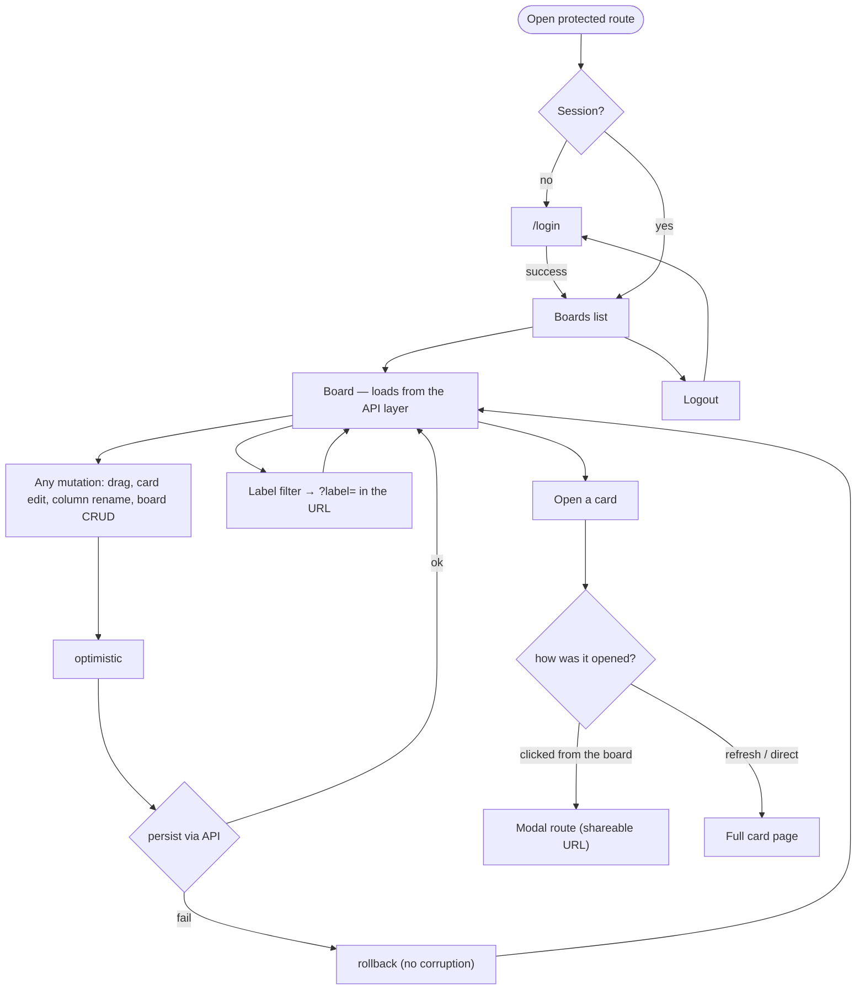

# Flow — Kanban Board · Middle

Screen / user flow for the build.

Card detail is a modal route with a full-page fallback. Every mutation persists through the API layer
optimistically and rolls back on failure — triggerable via the failure-injection toggle. The label filter
lives in the URL.
