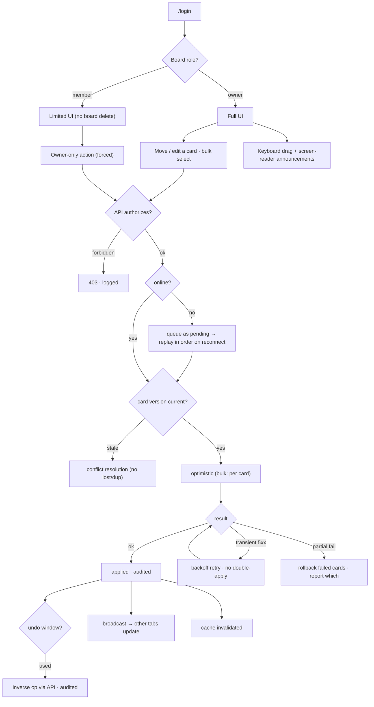

# Flow — Kanban Board · Senior

Screen / user flow for the build.

Roles and auditing are enforced in the API — a forced `member` request still gets a `403` and is still
logged. Other tabs stay in sync (storage / BroadcastChannel / polling); a concurrent move on the same card
resolves without corruption. Offline moves queue and replay in order; every applied mutation invalidates
the cache.
